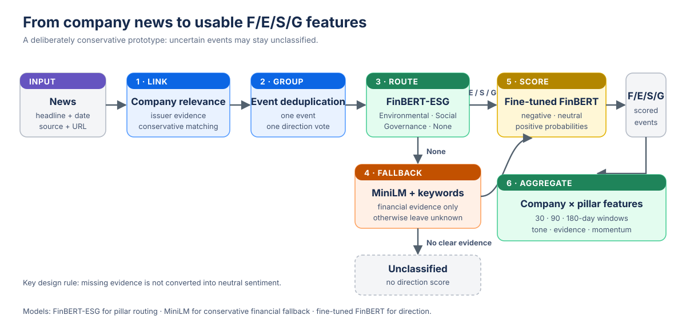
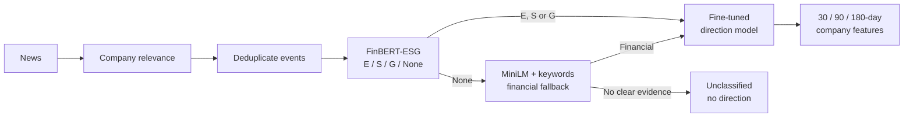

# News inference pipeline

The pipeline turns company-linked headlines into recent Financial, Environmental, Social, and Governance signals. Each stage has one clear responsibility, and uncertain articles are allowed to remain unclassified.

## How one headline moves through the pipeline

1. **Company relevance.** Deterministic issuer, ticker, related-entity, executive, and corporate-source evidence identifies the target company. A conservative MiniLM comparison is used only when the rules need support. The stored relevance value is evidence strength, not a calibrated probability.
2. **Event consolidation.** Near-duplicate coverage of the same company event is grouped before scoring. One syndicated story therefore receives one direction vote.
3. **Pillar routing.** `yiyanghkust/finbert-esg` reads a company-masked headline and predicts Environmental, Social, Governance, or None.
4. **Financial fallback.** Only a None result reaches `sentence-transformers/all-MiniLM-L6-v2`. Financial prototype similarity is combined with a small keyword check. A clear keyword match or a score of at least 0.46 assigns Financial; otherwise the event stays unclassified.
5. **Direction.** Every assigned F/E/S/G event is passed to our [fine-tuned FinBERT model](finbert_direction_model.md) as `Company + Pillar + Headline`. We retain all three probabilities. Unclassified events do not receive a direction score.
6. **Features.** Event-level signals are aggregated by company and pillar over 30, 90, and 180 days.

The MiniLM step is a conservative embedding-and-keyword fallback, not a separately fine-tuned financial classifier.

Mermaid version of the diagram

## From probabilities to features

For event $i$, direction is a continuous score rather than only a hard label:

$$
s_i=P_i(\text{positive})-P_i(\text{negative}), \qquad -1\leq s_i\leq1.
$$

Let $a_i$ be the event age in days and $r_i\in[0,1]$ its uncalibrated relevance strength. Recent, strongly linked events receive more weight:

$$
d_i=2^{-a_i/30}, \qquad w_i=r_i d_i, \qquad W=\sum_i w_i.
$$

Within each company, pillar, and time window, raw tone and the thin-evidence adjustment are:

$$
T=\frac{\sum_i w_i s_i}{W},
\qquad
\widetilde{T}=T\min\left(1,\frac{W}{3}\right).
$$

Momentum compares recent tone with the broader background:

$$
M=\widetilde{T}_{30}-\widetilde{T}_{90}.
$$

When there is no news, $T$ remains missing. The adjusted value is zero because the pipeline makes no news-based adjustment; it does **not** mean that the model predicted neutral.

## Verified prototype result

The fast prototype used 25 sector-balanced S&P 500 companies and a deterministic cap of 2,000 deduplicated events. Of these, 1,422 received a direction score and 578 remained explicitly unclassified. The output contains 25 company rows and 300 company–pillar–window rows.

| Assigned result | Events |
|---|---:|
| Social | 590 |
| Financial fallback | 577 |
| Environmental | 185 |
| Governance | 70 |
| Unclassified | 578 |

The strict company-relevance policy reached 96.06% precision, 76.73% recall, and 0.8531 F1 on a frozen 200-row, high-risk holdout. Its labels came from two independent model-review passes plus adjudication, so this is silver-label validation rather than human gold validation. It validates only that restricted 25-company prototype policy; the [compact validation record](../../outputs/news_nlp/relevance_validation.json) keeps the exact counts and boundary.

The [small runnable demo](../../notebooks/news_pipeline_demo.ipynb) uses synthetic headlines, while the [prototype manifest](../../outputs/news_nlp/prototype_manifest.json) records the checked 25-company run.

## Prototype boundary

- Retrieval came from a capped and incomplete frozen Google News sample, so article counts are not exhaustive or directly comparable between companies.
- Average tone and momentum are exploratory features, not audited ESG measures.
- The strict relevance policy passed; unrestricted matching and a full-500 run remain **NO-GO**.
- Headline classification can miss context, irony, later corrections, and events whose impact changes over time.
- Financial remains a separate pillar. It is not silently mixed into E, S, or G.

Models used: [FinBERT-ESG](https://huggingface.co/yiyanghkust/finbert-esg) at `f79fefa...`, [all-MiniLM-L6-v2](https://huggingface.co/sentence-transformers/all-MiniLM-L6-v2) at `1110a243...`, and our [fine-tuned FinBERT direction model](finbert_direction_model.md). Full revisions are recorded in the prototype manifest.
